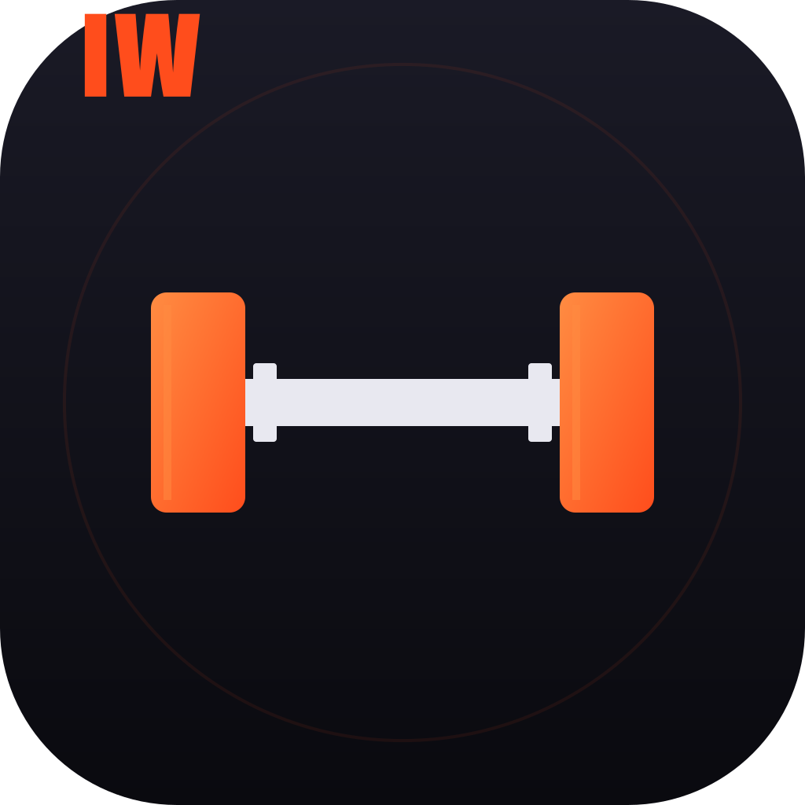
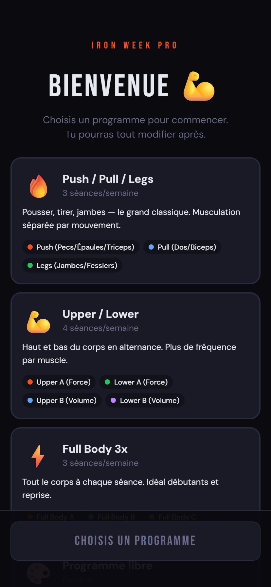
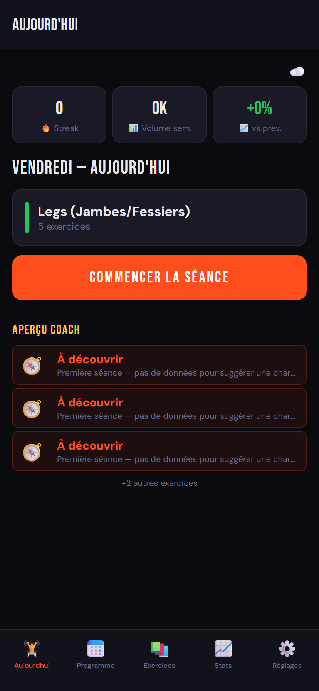
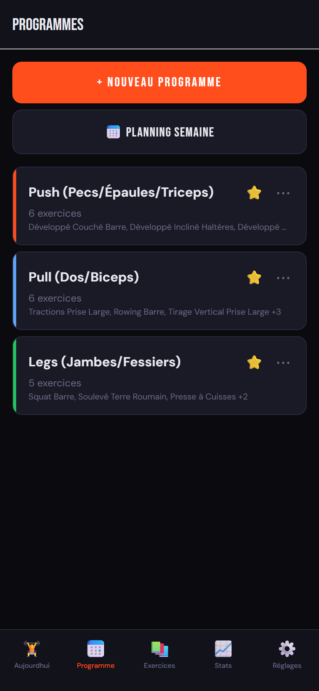
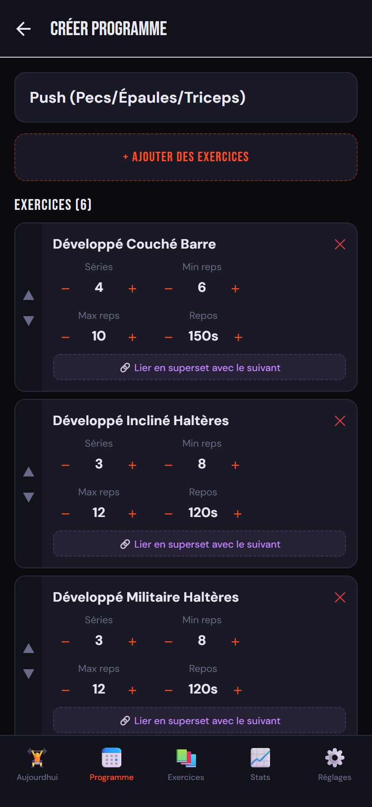
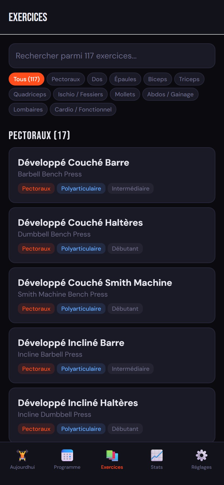
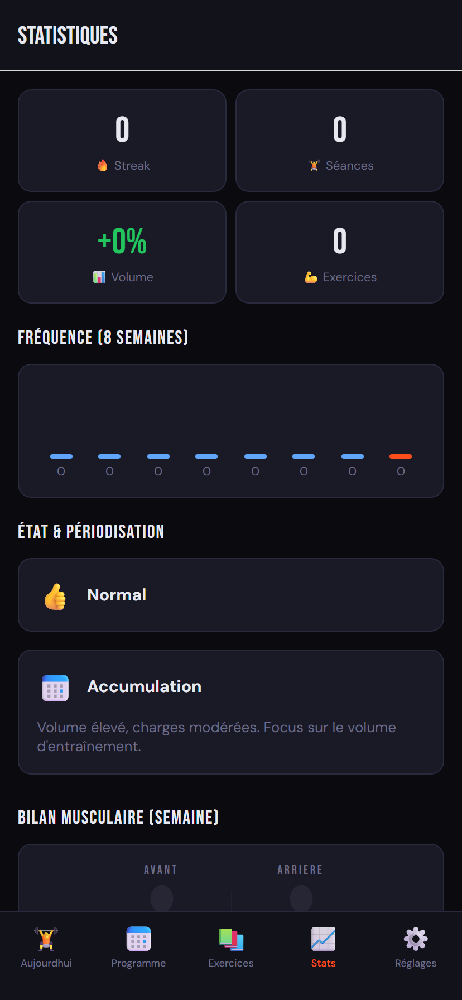
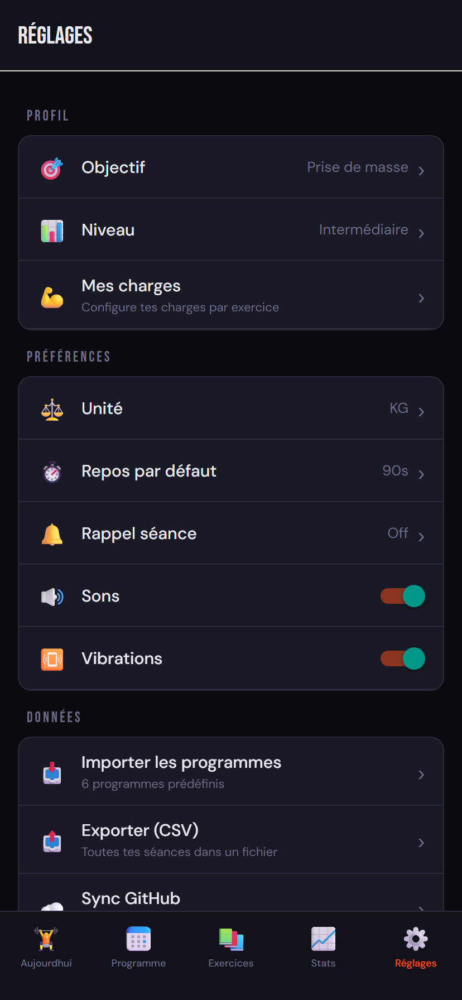

<div align="center">



# Iron Week Pro

**Coaching musculation IA — programmation, suivi, recommandations intelligentes.**

[](https://iron-week-pro.vercel.app)
[](https://expo.dev/accounts/fumikage/projects/iron-week-pro)
[](LICENSE)

</div>

---

## Aperçu

Une app de musculation qui pense pour toi. Tu choisis un programme, tu fais ta séance, et le coach IA te dit exactement quelle charge utiliser à la prochaine série en se basant sur tes performances réelles (formule d'Epley, RPE, fatigue accumulée).

> **Disponible en 1 clic** sur https://iron-week-pro.vercel.app — installable sur l'écran d'accueil iOS/Android (PWA).

<div align="center">

|                                          |                                            |                                                |
| :--------------------------------------: | :----------------------------------------: | :--------------------------------------------: |
|  |  |  |
|     **Onboarding — choisis un template**     |       **Aujourd'hui — séance du jour**       |        **Programmes — gérer tes séances**         |

|                                              |                                              |                                            |                                            |
| :------------------------------------------: | :------------------------------------------: | :----------------------------------------: | :----------------------------------------: |
|  |  |     |  |
|       **Création/édition de programme**       |     **117 exercices, filtre par muscle**      |    **Stats, fatigue, périodisation**     |   **Réglages — profil, données, sync**    |

</div>

---

## Fonctionnalités clés

### 🧠 Coach IA basé sur la formule d'Epley
Le coach calcule ton 1RM estimé en temps réel (`1RM = poids × (1 + reps/30)`) et propose la charge optimale pour la série suivante, pas un `+2.5kg` fixe.

**Exemple** : tu fais 12 reps à 80kg sur un exercice qui vise 8-10 reps.
- 1RM estimé : 80 × (1 + 12/30) = 112kg
- Charge cible pour 9 reps : 112 / (1 + 9/30) = **86kg → suggestion +5kg**

### 📊 5 règles de progression
1. **Double progressive overload** — atteint le max 2 séances de suite ? Monte la charge.
2. **Consolidation** — toutes les séries pas dans la cible ? Maintiens.
3. **Deload automatique** — chute de 20%+ vs ta meilleure ? Récupère.
4. **Stagnation** — 3 séances identiques ? Variation technique (rest-pause, myo-reps, tempo).
5. **Première séance** — pas d'historique ? Conseils qualitatifs, pas de chiffre inventé.

### ⏱️ Timer de repos qui sonne même téléphone verrouillé
Notification locale planifiée à `now + restSeconds`. Le téléphone vibre et sonne même si l'app est fermée.

### 💪 117 exercices + 4 templates
Push/Pull/Legs · Upper/Lower · Full Body 3x · Programme libre. Schémas anatomiques SVG, fiches détaillées, exercices substituts.

### 🔗 Supersets, RPE, échauffement auto, partage de séance
- Lier 2 exercices en superset (un seul timer entre les deux)
- Tracker l'effort ressenti (RPE 6-10) après chaque série
- Génération automatique de séries d'échauffement (50% × 10, 70% × 5, 85% × 3)
- Partage du résumé de séance en image (Instagram, WhatsApp, etc.)

### 📈 Stats & analytics
- Streak, volume hebdomadaire, fréquence sur 8 semaines
- Détection de fatigue / progression / stagnation
- Périodisation auto (Accumulation → Intensification → Réalisation → Deload)
- Ratios push/pull et quad/ischio
- Graphiques SVG par exercice (charge max, 1RM estimé, volume)

### ☁️ Sync GitHub + export CSV
Sauvegarde de toutes tes séances dans un repo GitHub privé (`data.json`). Export CSV pour analyse externe.

---

## ⚠️ Important — Sauvegarde des données

L'app est **100% locale** (pas de serveur, pas de compte). Tes séances sont stockées sur ton appareil. Selon comment tu utilises l'app, la sauvegarde se comporte différemment :

### 👉 Ce que tu dois faire

Pour ne **jamais perdre tes données** sur web, **installe l'app sur l'écran d'accueil** :

- **iOS Safari** : bouton « Partager » → « Sur l'écran d'accueil »
- **Android Chrome** : menu ⋮ → « Ajouter à l'écran d'accueil » (ou bandeau d'install qui apparaît automatiquement)

Une fois installée, l'app tourne en mode standalone et ses données sont protégées des nettoyages automatiques du navigateur.

### Si tu souhaite une Sauvegarde Multi-appareils 

> **Aucun pour l'instant.** Chaque appareil est un silo isolé, chaque utilisateur a ses propres données sur son propre appareil. Il n'y a pas de notion de « compte » partagé entre l'iPhone et le web, **même si tu es la même personne**.

```
   ┌──────────────────┐         ┌──────────────────┐
   │   📱 Téléphone    │         │   💻 Navigateur   │
   │  AsyncStorage    │         │  localStorage    │
   │   (silo 1)       │         │   (silo 2)       │
   └──────────────────┘         └──────────────────┘
            ✗  pas de communication par défaut  ✗
```

Si tu fais une séance sur ton téléphone, **elle n'apparaît PAS automatiquement sur le web** (et inversement). Pour les synchroniser, il faut activer **GitHub Sync** — qui transforme un repo GitHub privé en mini-base de données partagée :

```
   ┌──────────────────┐                    ┌──────────────────┐
   │   📱 Téléphone    │  ←── push/pull ──→  │   💻 Navigateur   │
   └────────┬─────────┘                    └─────────┬────────┘
            │                                        │
            └──────────►  ☁️  data.json  ◄───────────┘
                       (repo GitHub privé)
```

#### Comment configurer

**Étape 1 — Créer un token GitHub** (5 secondes)

Va sur [github.com/settings/tokens](https://github.com/settings/tokens) → « Generate new token (classic) » → coche **uniquement** le scope `repo` (Full control of private repositories) → copie le token (commence par `ghp_...`).

**Étape 2 — Créer un repo privé vide**

Va sur [github.com/new](https://github.com/new) → nom au choix (ex: `my-iron-week-data`) → coche **Private** → crée le repo. **Ne mets rien dedans**, l'app va créer le `data.json` automatiquement.

**Étape 3 — Renseigner dans l'app**

Dans l'app, va dans `Réglages → Sync GitHub` :
- Token : colle le `ghp_...`
- Repo : `username/my-iron-week-data` (ton nom GitHub + nom du repo)
- Tap **SAUVEGARDER** → l'app teste la connexion
- Tap **SYNCHRONISER** → upload de toutes tes séances

**Étape 4 — Sur ton 2ème appareil**

Ouvre l'app sur le 2ème appareil (web ou tel) → mêmes credentials → tap SYNCHRONISER. L'app détecte le `data.json` existant et **pull** les données. À chaque séance terminée, l'app push automatiquement.

#### Ce qui est synchronisé

- Toutes tes **séances** (date, charges, reps, RPE, notes)
- Tes **programmes** (créés ou importés)
- Le **planning hebdo**
- Tes **records personnels** (PR)
- Le **profil de force** (Mes Charges)

#### Ce qui ne l'est pas

- Le token GitHub lui-même (stocké en SecureStore sur native, en localStorage sur web — il faut le renseigner sur chaque appareil)
- Les notifications planifiées (locales à chaque appareil)

#### Avantages

- **Gratuit** (GitHub Free a des repos privés illimités)
- **Privé** : tu es seul à voir tes données
- **Versionné** : chaque sync est un commit, tu peux voir l'historique de tes séances dans GitHub
- **Portable** : tu peux télécharger le `data.json` à tout moment et l'analyser ailleurs (Excel, Python, etc.)
- **Aucune dépendance** : si l'app disparaît demain, tes données restent sur ton repo

---

## 🐛 Tu rencontres un bug ou tu as une idée ?

> ### **Remonte-moi les problèmes ou tes recommandations**
>
> **🐛 Bug** ou **💡 Suggestion** : ouvre une issue sur GitHub → [Iron Week Issues](https://github.com/Fumikage-DarkShadow/iron-week-pro/issues/new)
>
> Tu peux aussi me ping directement : [@Fumikage-DarkShadow](https://github.com/Fumikage-DarkShadow) 
>
> Toute remontée est précieuse pour améliorer l'app (capture d'écran, étapes pour reproduire, ou simplement t'es idées ;)


